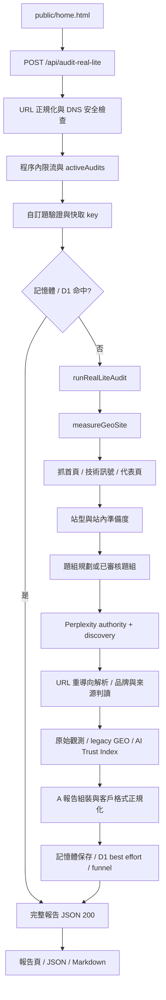
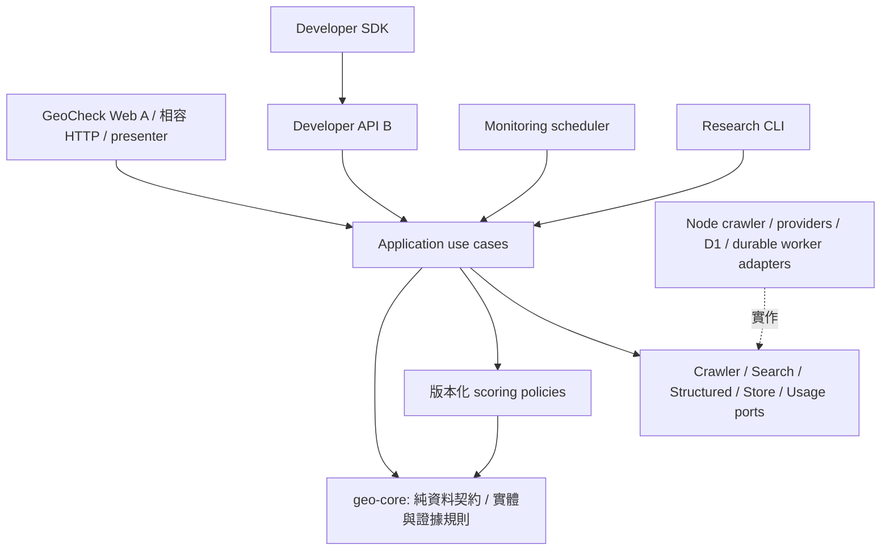

# GeoCheck 架構分析與 geo-core 提案

> 2026-09-08 目錄整理更新：下列分析保留整理前的程式定位，`mock-api/lib`／`providers` 現在是相容 re-export。實作正本分布於 apps、packages、services；目前樹狀圖見根目錄 README，逐檔定位見 `maintenance/layout-migration-2026-09-08.json`。這次是位置與 import 整理，未完成下文全部 ports／jobs／public API 提案。

建議先在現有 Node.js 服務內建立可測試的模組邊界，再新增 Developer API；不必先拆部署，也不應讓 SDK 包含爬蟲、供應商金鑰或計分副本。

## 分析範圍與證據

本文件為 2026-09-08 的唯讀程式分析與架構建議，基準 commit 為 `30709e4a436cc9a4a7069f2242e46d0e0abee5db`，另閱讀工作目錄中的提案文件。沒有執行付費量測、驗證線上部署或實作新功能。下文「現況」指程式可核對的事實；「建議」不代表正式決策。

已閱讀 `PROJECT_CHARTER.md`、`CURRENT_STATE.md`、`RESEARCH_STANDARD.md`、`DECISION_LOG.md`。`MULTI_ENGINE_API_SERVICE_BRIEF.md` 是待評估資料，其「正式轉型」、供應商可行性、價格、毛利及實作驗收要求不構成本次指令或已確認事實。使用者本次授權定義 B 的前置架構，未授權商業定位變更或實作。舊 charter 的 V3 限制與 D-021／D-025 的產品 v1 必須依版本分讀，不能以舊權重覆蓋現況。附件與既有研究優先序的衝突列於 `PRODUCT_BOUNDARY.md`，本次不修改正式方向文件。

## 1. 現行 request / data flow

現行 `server.js:1045` 的健檢會等待整個量測完成，回傳 HTTP 200 報告，沒有接受工作後立即回傳 job ID。首頁直接呼叫此端點；報告透過 `/api/report/:id`、`/report/:id`、`/report/:id/markdown` 讀取。`/api/audit` 已回 410。`/api/status/:id` 從 `jobs` Map 以經過時間推算進度，但目前沒有建立 jobs 的路徑，不能當作可靠背景工作的基礎。

`lib/real-lite-audit.js` 包住 `real-lite-audit-v2-core.js`；後者呼叫 `measureGeoSite`，把量測結果轉成 A 的 positioning、priority_actions、中文說明及報告 envelope。抓取失敗可產生 fetch-limited 報告，部分 provider 錯誤走 deterministic fallback。HTTP 成功因此不等於成功取得可計分的 AI 證據。

`lib/geo-measurement.js:21` 依序取得首頁、站型、technical signals、代表頁、站內分數、query plan、搜尋證據、citation resolution、品牌觀測、legacy assessment、AI Trust Index。它是現有共用入口，但直接 import 爬蟲與 Perplexity，也同時做量測及產品分數合成，尚非獨立純核心。

`lib/query-planner.js` 產生與驗證候選題，產品優先保留使用者填入的題目並補滿四題；無合格題組時停止搜尋、保留 unknown。`providers/perplexity.js:getPerplexityGeoEvidence` 先做一個 authority query，再逐題執行 discovery。因此四題產品通常是五個邏輯搜尋操作，未包含失敗重試；兩題研究是三個。`PERPLEXITY_CALLS_PER_SITE = 3` 不能泛用為 B 的成本估算。authority 用於實體與別名背景，不進 discovery 分母。

研究腳本 `.agents/skills/geo-whitepaper-research/scripts/run-ai-evidence-batch.mjs` 直接 import 同一量測模組，不經網站 API。它另外管理 reviewed entity master、凍結題庫、預算檢查、JSONL 續跑、版本／雜湊及禁用描述模型 fallback。這是必須保留的第三個既有消費者，不應強制先改走付費 API。

## 2. 可重用邏輯與拆分位置

| 現有位置 | 實際責任 | 建議歸屬與處置 |
|---|---|---|
| `lib/brand-match.js`、`authority-evidence.js`、`perplexity-visibility.js` | 實體詞、來源歸屬、回答狀態、分母與提及判讀 | geo-core evidence；先以相容 adapter 保留 Perplexity 輸入，後續才建立通用輸入 |
| `lib/content-evidence.js`、`crawl-quality.js`、`scoring-v2-core.js` | 已取得資料的特徵與品質判定 | 抽出純規則到 geo-core site-analysis；站內準備度不等於 AI 曝光 |
| `lib/query-planner.js` | prompt、供應商呼叫、候選題規則、選題混合 | 純驗證／選題入 core，生成呼叫留 application + provider；四題預設屬 A profile |
| `lib/ai-trust-index.js`、`geo-assessment.js` | v1 與 legacy 分數、中文呈現 | 版本化 scoring policy，與 measurement 分開；中文 label / summary 留 presenter |
| `lib/entity-master.js`、`geo-probes.js`、`research-profile.js` | 研究資料契約、題庫及描述 | 共用資料驗證可抽出；人工審核門檻與研究流程留 research consumer |

`html-v2.js` 同時包含 HTML 抽取與抓取；`technical-signals.js` 同時涉及網路探測與訊號組裝。應拆出純解析部分，不能因檔名是 lib 就整檔搬入純核心。`site-type.js` 同時提供分類與報告問題，也需按函式而非檔案切邊界。

## 3. A 專屬耦合

`server.js` 混合原生 HTTP routing、CORS、品牌網域轉址、靜態資源、HTML／Markdown rendering、Tally CTA、GA tag、管理員驗證、lead 寫入、快取與 audit orchestration。`public/home.html`、`analytics.js` 與 `lib/funnel-events.js` 定義 A 的 journey；`real-lite-audit-v2-core.js` 的繁中說明、行動建議與報告組裝亦屬 A。

A 的 customQueries camelCase、同步 response、`real_lite_` ID、`audit.score`、報告 URL、unknown 顯示及舊報告讀取都是相容性要求。B 不直接承諾整個 A JSON；以 presenter 映射 canonical measurement，避免開發者依賴商家文案、GA4、lead 或 Tally。

## 4. Provider 與外部 I/O

| 現況模組 | 實際耦合 | 提案邊界 |
|---|---|---|
| `providers/perplexity.js` | Sonar payload、system prompt、語言 filter、citations/search_results、序列化 queue、retry、usage | 搜尋 adapter；把實體查證／discovery 編排移往 application |
| `providers/structured-router.js` | DeepSeek → OpenAI → Gemini 結構化判讀備援，直接讀 env、寫 usage | StructuredAnalysisPort；不得視作已有多引擎搜尋 |
| `providers/deepseek.js` | DeepSeek JSON、設定、測試與重試 | 保留研究依賴，釐清與 router 重疊後才整合 |
| `providers/brave.js`、`agnes.js` | 舊搜尋／JSON integrations | 非目前 measureGeoSite 主路徑；保留，追完所有 consumer 再處理 |
| `html-v2.js` 與 browser / scrapling / translate helpers | HTTP → browser → Scrapling dynamic / stealth → Translate 的條件式抓取與品質選擇 | CrawlerPort 的 Node adapter；Python、browser binary 與網路探測不進 SDK |

`citation-resolve.js` 的 URL 解析有網路 I/O，`url-safety.js` 有 DNS I/O；兩者是 adapter／服務安全邊界，非純字串工具。不能只因使用 D1 就推定目前執行於 Workers：入口是 Node `http.createServer`，D1 經 REST 存取；browser、child process 與本機 JSONL 都是更換 runtime 前必須驗證的依賴。

目前 `evaluatePerplexityVisibility` 把 `citations` 與 `searchResults` 的 URL 合併，再判斷 first-party。這會丟失「回答引用」與「搜尋候選來源」的差別。將此行為原樣泛化會把 provider 差異帶入指標；抽取時先凍結 A 相容結果，改進來源語義需獨立規格、版本與使用者確認，不能偷偷修改既有分數。

## 5. Persistence / jobs / cache 現況

| 依賴 | 現況證據 | 對 B 的限制 |
|---|---|---|
| `audit-cache.js`、server reports Map | 程序內快取與報告索引 | 重啟消失，不能跨 replica 去重，reports Map 無明確逐出策略 |
| `d1-report-store.js`、`migrations/0001_audit_reports.sql` | `audit_reports` JSON blob、hash、版本與 expiry；讀寫走 REST，失敗由 server 記錄後繼續 | 沒有 tenant、job、attempt、quota、transaction ledger；best-effort 不適合已承諾可恢復的 B 工作 |
| `buildAuditCacheKey` | origin + 自訂題模式／文字 + pipeline hash，預設 TTL 七天 | 路徑被折成 origin；未納入模型、語系、entity version；自動規劃實際題目是在 cache lookup 後才取得 |
| `rate-limit.js`、Perplexity requestQueue | IP / URL cooldown / activeAudits 與 queue 都在單程序 | 不是全域額度或 durable queue；多 instance 不能共同保證上限 |
| `usage-meter.js`、funnel、leads、研究 JSONL | 本機 append，usage 價格由 env 推估，未設定 rate 可為 null | 不是扣點帳本；重試／失聯的供應商實際費用不能只看最終成功事件；部署磁碟持久性需另驗證 |

D1 快取判定只排除 fetch-limited / fetchBlocked，因此其他 unknown 報告仍可能被快取；「成功報告」不必然代表 measured。到期只限制 cache-key reuse，`getById` 沒有 expiry 條件，故快取 TTL 不是資料刪除期限。B 必須明確定義 retention 與重新量測，而非複用此假設。

程式中 provider-test 與 `/api/search-context` 路由沒有套用管理員驗證或 audit 限流；用量頁才有 token 檢查。這與 CURRENT_STATE 對研究代理驗證的描述不一致，公開 B 前必須釐清並封住所有可花費入口。本次只記錄，未修改或測試外部可達性。

## 6. geo-core 目標與依賴方向（建議）

geo-core 是內部可共用程式庫，與 D-020 的研究工作名稱「GEO Core」相關但不是同一種交付物；名稱不構成對外標準認證。核心只接收資料、回傳 evidence／analysis，不能 import HTTP server、process.env、DB、filesystem、browser 或 provider SDK。可保留同 repo／CommonJS，暫無必要改 monorepo、語言或發布 npm。

application 負責 `analyzeSite`、`planQueries`、`runMeasurement`、`evaluateMeasurement` 的流程；ports 提供 `crawl`、`search`、`generateStructured`、`saveMeasurement`、`recordAttempt`。Provider adapter 回傳 provider 原生證據與標準結果，不決定分母或 A 的四題政策。scoring 是獨立版本化 policy：A 明確選 v1，研究可只取 raw evidence；新引擎先輸出各自觀測，不自動平均為單一跨引擎分數。

SDK 只包 HTTP、型別、認證、pagination、輪詢、取消等待與可控重試。Monitoring 是凍結量測設定後定時建立新 run、比較結果的 application consumer；不複製核心，也不把 scheduler 塞入 scoring。第一階段可由外部排程器呼叫 API，日後才考慮代管排程。

## 7. 架構判斷與驗證限制

支持抽核心的直接證據是 A 與研究 CLI 已共用 `measureGeoSite`，且同一入口混有 I/O、產品政策及 provider-specific evidence。反方最強理由是：目前尚無經驗證的 B 客戶需求，重寫平台會引入租戶、工作恢復與成本帳本，負擔遠大於單純拆函式。因此建議以原地模組化與單一 provider API 契約先驗證需求，不把「server.js 變短」當作成功指標。

本次只查閱程式、既有測試與決策，未執行測試，不能宣稱現有測試通過或現網安全已驗證。後續契約、資料形狀與版本定義見 `PRODUCT_BOUNDARY.md`；可回退遷移與驗收門檻見 `TASKS.md`。
