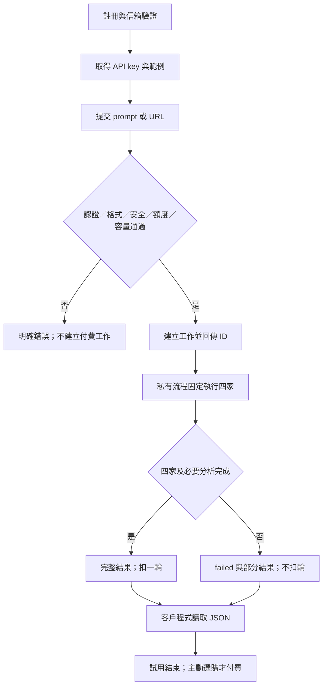
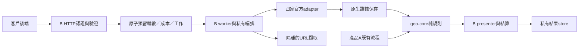

# GeoCheck 附屬 API：產品與架構交接設計

版本 0.3｜2026-09-08｜狀態：完成文件複審；B0／B1 離線雛型已實作並通過本機驗證，未上線、未呼叫真實供應商。啟動邊界見 [PROTOTYPE_RUNBOOK](PROTOTYPE_RUNBOOK.md)，審查結果見 [REVIEW](REVIEW.md)。

本文件供後續實作模型閱讀。使用者此次授權完成設計，不授權實作、部署、儲值或付費請求。正式決策以 D-027～D-030 為準；以下標為「建議」的客群、流程細節與技術選擇，不因寫入文件就成為正式決策。安全設計見 [SECURITY](SECURITY.md)，實作順序與待決表見 [HANDOFF](HANDOFF.md)。

## 1. 已確認的商品

客戶程式提交 prompt 或 URL，GeoCheck 在私有伺服器內固定呼叫四家官方 AI 搜尋 API，完成引用整理與 GEO 分析，回傳一份結構化結果。客戶不選模型、不持有供應商金鑰。B 是附屬產品，A 的網站、分數、既有 Perplexity 流程與研究流程維持各自契約。

| 項目 | 已確認內容 | 尚未決定 |
|---|---|---|
| 引擎 | OpenAI、Google、Anthropic、Perplexity 官方直連；D-028 選定模型仍待帳戶驗證 | 搜尋參數與每輪內部問題數 |
| 成功 | 四家全部完成才成功；一家最終失敗則整體 failed，可回 partial_results | 「有效完成」的詳細品質門檻見下方建議 |
| 扣量 | 成功一輪扣一次；失敗不扣量，上游成本自行吸收 | 付費週期、效期、稅務與退款 |
| 試用 | 註冊後7天，每天最多3輪，不累積、不綁卡、不自動付費 | 日界線與啟用起點的細節 |
| Beta | Basic TWD 660／80輪；Premium TWD 1,390／170輪；約45%毛利方向 | 這不是已確認月費；不沿用先前90天效期建議作定案 |

單輪 TWD 4 與約48%～49%方案毛利都是早期試算假設。毛利需計入失敗、重試、直接服務成本與金流；免費流量另外列獲客成本。沒有固定成本、回購率與工時實測，不能宣稱公司已達損益兩平。

## 2. 建議主打誰、替他完成什麼

「低端市場」在本設計指預算有限、願意自助串接的使用者，不代表降低引用品質。尚無足夠第一手客戶證據；以下是要驗證的客群假設，不改 PROJECT_CHARTER 的 A／研究定位。

| 優先 | 建議客群／買單者 | 真實工作情境 | 交付價值與反方 |
|---|---|---|---|
| 首批 | 會寫腳本的獨立網站開發者、接案者、小型工具作者；本人付費 | 為客戶網站或自己的工具加上一次 AI 引用分析 | 省去四家串接、解析與維護；反方是使用低頻，可能試完不再用 |
| 第二批 | 有技術能力的小型 SEO／GEO 接案團隊；負責人付費 | 把分析 JSON 放進自家報告或工作流 | 能用來源與逐家結果向客戶解釋；反方是既有 SaaS 已足夠 |
| 暫不優先 | 不會串 API 的一般商家、大企業採購 | 前者需要操作介面，後者需要高服務承諾 | 第一版獲客與支援成本不匹配，商家仍可使用產品 A |

候選對外一句話：**一次呼叫，取得四家官方 AI 搜尋 API 的回答與引用分析，直接接進你的工具。** 這是待審文案。不得宣稱等同消費者版 ChatGPT／Gemini／Claude 網頁體驗、全網排名、必然被引用或帶來業績。

強化功能建議先限於四項：來源類型正規化、逐家品牌／目標網址比對、可追溯差異比較、明確失敗與未知狀態。DeepSeek 統合摘要維持可選且未核准；不建立未經確認的跨引擎總分。

## 3. 使用者流程（候選設計）



註冊入口未供應就緒時只顯示候補，不能讓7天計時白白流失；沒有上游額度時回服務未開放，而非 fake success。第一位免費使用者仍會消耗營運者資金，「有使用者再儲值」不等於「有收入才會花錢」。

依D-032，帳戶建立本身不開始試用：使用者首次進入 API Key 管理介面即開始服務資格計時，即使沒有建立key也算；建立key前仍須選 Free、Basic 或 Premium。Free試用建議分成7個連續24小時配額窗，UTC儲存、顯示當地時間；每窗3次，最多21次；以接受工作時所在窗預留，完成跨窗仍結算原窗。這是避免跨午夜得到第8個配額日的建議，待核准。未驗證信箱不能發起真實分析；重寄驗證不重置試用。Basic／Premium已確認為訂閱制，但週期、續費、取消與付款失敗規則未定；金流未實作前不能用方案選擇假發額度。

使用者只需一次 POST 建立分析；查進度與取得結果的 GET 不另扣輪數。建議非同步工作，客戶自行輪詢；SDK與webhook後置。試用期滿仍可在保存期限內讀舊結果、撤銷金鑰與刪除內容。付款未實作時不展示假結帳或自動發放付費額度。

## 4. API 介面與內容邊界（草案）

沿用既有候選 `/v1/measurements`，不再增加同義 `/analyses`、`/observation-runs` 路由。方法如下：

| 方法 | 契約 |
|---|---|
| POST /v1/measurements | Bearer key + 必填 Idempotency-Key；持久化成功後202，回 job_id、measurement_id、Location |
| GET /v1/jobs/:id | 200回 queued/running/succeeded/failed；failed是工作狀態，不等同讀取HTTP失敗 |
| GET /v1/measurements/:id | 完成結果200；尚未完成409 result_not_ready；不屬本人與未知ID一致404 |
| GET /v1/usage | 回已用／預留／剩餘輪數、試用到期與下次配額時間，不公開上游成本或其他租戶資料 |
| DELETE /v1/measurements/:id | 僅終態可刪，204；處理中409；刪內容不退款、不還原已用輪數 |

無公開引擎選擇、外部callback、批次無上限提交、任意provider URL、system prompt覆寫或任意工具執行。

建議兩種互斥輸入：

```json
{"input":{"type":"prompt","text":"台北有哪些適合成人的英文家教平台？"},"target":{"name":"Example","url":"https://example.com/"},"locale":"zh-TW"}
```

```json
{"input":{"type":"url","url":"https://example.com/course"},"locale":"zh-TW"}
```

target可省略：沒有目標品牌時仍輸出四家答案與來源，品牌指標為null；不能猜一個品牌後算成0。target是客戶聲明，不是已驗證所有權。URL保留完整path，不自動縮成origin；只接受公開頁面，登入頁、私人文件與全站爬取不在候選首版。

**每輪範圍依D-031、D-033確認：一個原樣觀測prompt、四家各執行一次邏輯觀測；使用者問題優先。** prompt已提供觀測問題時直接採用，不另生成或改寫；沒有問題時才依輸入內容以版本化模板／規則自動生成一題，URL模式先取得有限單頁內容。保存effective_prompt與question_source（user／generated），四家接收同一個最終prompt。單一prompt即是一個任務：系統不猜選哪題、不拆成多輪、也不替各provider各出一題；客戶把多題寫在其中仍作同一任務，應提示比較與完整性可能下降。LLM planner是日後實測後才考慮的升級，不能擅自加入第五家或當作既定成本。不能把完整網站分析暗藏成16次呼叫。URL內容預設只供選題／目標識別，不塞入搜尋回答當作自然引用證據，以免把自己提供的品牌內容誤認為自然被發現。

建議每輪結果包含：

| 資料 | 意義 |
|---|---|
| measurement_id、status、observed_at、expires_at | 可追溯且有期限的單次結果 |
| effective_prompt、input_mode、target、locale | 讓客戶知道到底問了什麼；未能套用地區時標unknown |
| pipeline_version、profile_set_version、analysis_version | 私有流程仍須能追蹤版本；不公開完整system prompt |
| engines[4] | 各家provider/model/search surface、完成狀態、answer、source IDs、錯誤分類 |
| sources | answer_citation/search_result/inline_url分開；URL相同可去重但保留出處 |
| analysis | 每家提及與引用匹配、比較表與limitations；每項判讀回指證據 |
| partial_results | failed時已有的合格結果；完整comparison為null |
| quota.charged_rounds | succeeded=1、failed=0；actual cost不對客戶露出 |

建議成功條件：四家皆有非空可解析回答，符合輸出schema，且有供應商原生搜尋執行證據或通過驗收的搜尋模式證據；必要的結果組裝與保存成功。引用為空但回答與搜尋有效，可以成功，並顯示未觀察到引用。拒答、截斷、不可解析、未完成搜尋或上游錯誤不算完整成功。HTTP200本身不能當成功依據。此判準需人工驗收fixtures後凍結。

找得到來源URL不等於來源支持所有說法。首版不做無上限全文事實查核；未查證claim support維持unknown。重跑可能有不同答案，只有固定證據重算才要求計算一致。

## 5. 內部架構與 A 隔離



建議先用既有Node專案的模組化設計，不搬到新runtime、不複製server.js。B入口與worker以獨立開關及資源池控制；共享可驗證的純函式，A不改成B客戶，也不經過B四家流程。若同機，B限制process memory/CPU、連線與worker數，避免B壓力吃掉A；付費帳戶配額也可能共享，需獨立專案／帳戶或保留A額度，不能只靠不同API key就宣稱隔離。

| 位置 | 後續責任 | 現況限制 |
|---|---|---|
| services/api/application | B orchestrator、輸入規劃、成功判定、結算協調 | 已有profile骨架，不代表四家client可用 |
| services/api/ports | search、crawl、store、quota/cost介面 | 僅部分骨架 |
| packages/ai-providers | 各家adapter、fixture解析 | A既有Perplexity不能直接當B契約驗收 |
| packages/geo-core | 純資料規則、來源／品牌分析 | 不導入網路、環境變數、資料庫或金流 |
| services/api/storage、guards | tenant授權、原子帳本、工作持久化與安全 | A快取與本機usage紀錄不能冒充B帳本 |
| apps/web | A原有資源與報告 | 不新增B dashboard或改A行為 |

儲存選型建議保留單一交易型store port；實作者先用候選資料庫證明atomic transaction/CAS、唯一約束與claim語義，再定adapter。D1經REST存取的現況不自動保證跨請求原子性。缺少交易語義時不能用Map代替持久配額。依D-035，B雛型只以**獨立D1**保存客戶可讀的結構化結果；不保存HTML、完整provider原文或tool trace，也不共用A的`geocheck-reports` D1。結果寫入前須有明確序列化大小上限，避免撞到D1單列2 MB限制；超限不可悄悄截斷並宣稱完整成功。

概念資料表（不是migration）：tenants/accounts、api_keys、trial_windows、entitlement_grants、jobs、provider_attempts、measurements、private_evidence、quota_reservations、quota_events、cost_reservations/cost_events、outbox、security_events。所有使用者資料帶tenant_id，唯一性至少包括tenant+operation+idempotency_key、job+charge事件。金額以最小整數計算單位與幣別記錄，未知成本為null並保留估價／實際值及匯率日期。

同一交易建立工作、預留1輪與全域成本、outbox；容量不足就拒絕接受工作。worker claim須有lease及fencing token，過期worker不得覆寫結果。上游前先寫attempt；服務重啟後只恢復未完成步驟，成功部分不重打。超時不代表上游沒收費，不承諾exactly-once外部呼叫。

最終結果與輪數結算在同一原子提交：成功保存結果並扣一次；失敗保存部分結果並釋放輪數。若大證據存object store，先私有暫存且驗hash，再以交易發布引用，失敗暫存定期清理。資料庫不可用時停在待恢復內部stage，不先回成功。客戶斷線不取消工作；GET重讀、同key重送不重扣。結果ready即視為交付，不等客戶實際GET才收費，以免跳過GET規避扣量。

### 複審補充：不可省略的契約約束

上述設計後續需用以下不變條件驗收，不代表另行授權實作：

- 重送先驗證現行身分及tenant，再查idempotency，最後才對新工作檢查額度與試用期限；有效key即使額度耗盡也能取得原job。相同key不同內容回409；撤銷key不能藉重送讀資料。已刪內容只回不含內容的終態／tombstone，不重新呼叫供應商。去重保證期限須在契約明示，期限後不得宣稱仍保證相同key不重跑。
- queue 20是容量上限，不是必須接滿。admission須把預估等待與有界執行時間納入180秒deadline；無法容納則拒絕。持久化逾期清理工作處理無worker接手的job，釋放客戶reservation；未知上游成本另保留。deadline後不開新attempt，也不把遲到回應改成成功扣量；終態不可逆，晚到帳單只補成本。
- lease/fencing只保護內部寫入，不能撤回已送出的上游請求。恢復時attempt若已發送但未可靠保存結果，視為ambiguous，不能因資料庫沒有answer就重新發送。公開HTTP暫時不可用不等於已持久化job失敗，客戶用原key查詢；job終態與HTTP錯誤分開。
- 接受工作時固定問題、profile、分析及schema版本；回傳requested與實際可確認的model／locale／搜尋證據，未知不補猜。來源URL匹配不得用字串包含判官網；第一方身分未驗證時只稱「符合客戶提供的目標」，不冒充已驗證官網。B不直接沿用A分數。
- 管理帳戶與機器分析是不同權限。後續B0需補註冊驗證、登入恢復、發key／撤銷key、帳戶刪除的管理契約與範例；不因此擴建dashboard。普通分析key不能建立新key或提高額度。驗證方式與store選型尚未定案。

## 6. 產值與驗證目標

以下是建議實驗目標，不是已實現成效；數值由使用者確認後才可作正式KPI。避免用引用率上升或營收保證衡量API價值。

| 目標 | 建議驗證方式／門檻 | 不成立時怎麼做 |
|---|---|---|
| 降低串接成本 | 5位目標開發者；至少4位能在30分鐘內用範例取得首份mock JSON | 改文件與錯誤訊息，不先加功能 |
| 降低整理工時 | 至少3位以相同任務比較原流程／GeoCheck，記錄有效人工時間；目標中位數省50% | 縮小要解決的工作，不宣稱省時 |
| 有再次使用價值 | 前10位真實試用者中至少5位在不同日期成功分析新輸入；排除自動retry與GET | 訪談原因；不能用免費流量多當需求成立 |
| 願意支付 | 在前10位中至少2位明確願以660／1390購買；金流未接前只算意願，不算收入 | 檢查用途／價格，避免擴免費預算掩蓋問題 |
| 工程品質 | mock安全／配額測試全過；經授權live sample全成率目標95%、執行P95≤120秒 | 若低於門檻不公開承諾SLA；改善瓶頸 |

品質目標：每項引用判讀可回指原始證據；人工標註fixture全通過只是測試結果，不可當全市場準確率。live成本樣本建議先20輪小批，核對帳單後再決定是否擴到200輪；原建議200輪不是目前付費授權。

經濟公式：每成功輪成本＝全部已接受工作的上游費、失敗／重試費與直接執行成本 ÷ 成功輪數。另列免費群組花费與付費群組成本，方案用滿時毛利＝(未稅收入－直接成本－金流費)/未稅收入。免費獲客成本＝免費群組花費/新增付費客戶；分母0時為無法計算，不能填0。

產能受最慢供應商的RPM、TPM、搜尋限額、worker數、URL擷取與支援工時共同限制。候選上限＝各家min(RPM/每輪attempt數, TPM/每輪tokens)的最小值，再乘0.5保留餘裕；實際帳戶限额未知，不承諾Premium更快。擴張條件是排隊、成本與A資源隔離有實測，再提高小幅度上限。
