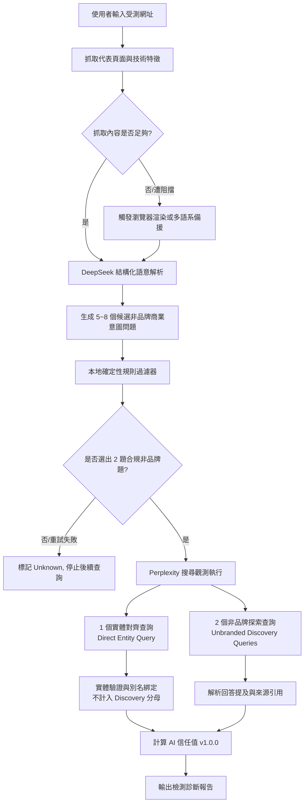
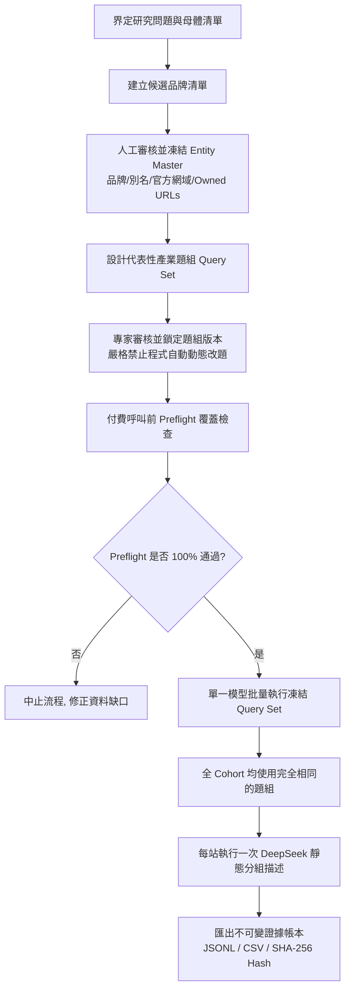

# GeoCheck 生成式引擎優化（GEO）產品與方法論白皮書

**副標題**：從黑盒猜測走向可觀測證據：AI 信任值、量測架構與透明度指南  
**版本**：v1.0.0（草案）  
**發布日期**：2026-09-03  

---

> [!important] 重要聲明與研究邊界
> 1. **非商業成效保證**：GeoCheck 量測的是特定條件下「可觀測的搜尋與引用證據」，**絕不承諾或保證**任何搜尋引擎或 AI 平台的特定排名、推薦率、點擊流量、獲客量或營收轉換。
> 2. **非模型內部認知**：產品指標「AI 信任值」（AI Trust Index）為系統量測「AI 在公開回答中採用品牌」與「引用第一方官方來源」之客觀證據率，**不代表**大型語言模型（LLM）內部神經網路的實際信念、真實偏好或不可見的權重狀態。
> 3. **未知不等於零**：平台服務中斷、網路逾時、API 拒答或無法解析之回答，均歸類為「未知（unknown）」，一律排除於計分分母之外，絕不假定為「表現為 0 分」。

---

## 目錄

1. [緒論：為什麼需要可觀測的 GEO 方法論？](#1-緒論為什麼需要可觀測的-geo-方法論)
2. [量測架構：三權分立的指標體系](#2-量測架構三權分立的指標體系)
3. [單站產品檢測流程：動態發現與即時分析](#3-單站產品檢測流程動態發現與即時分析)
4. [白皮書研究批次流程：凍結題組與嚴謹母體](#4-白皮書研究批次流程凍結題組與嚴謹母體)
5. [指標解讀：AI 信任值與評分規則](#5-指標解讀ai-信任值與評分規則)
6. [證據判定：提及、引用與實體對齊](#6-證據判定提及引用與實體對齊)
7. [網站技術準備度：基礎建設與非因果限制](#7-網站技術準備度基礎建設與非因果限制)
8. [研究限制、治理與複現標準](#8-研究限制治理與複現標準)

---

## 1. 緒論：為什麼需要可觀測的 GEO 方法論？

### 1.1 從傳統 SEO 到生成式引擎優化（GEO）

傳統搜尋引擎（如 Google、Bing）的核心是「排序藍色連結（Ranked Blue Links）」，其評估體系以關鍵字排名、展示次數（Impressions）與點擊率（CTR）為中心。

生成式 AI 搜尋（如 Perplexity、ChatGPT Search、Google AI Overviews）改變了答案的呈現方式：**AI 直接生成綜合解答，而非僅列出網頁清單。**

在生成式對話情境中，品牌面臨全新的曝光型態：
- **答案採用（Answer Adoption）**：AI 在推薦解決方案或回答知識性問題時，是否主動提及該品牌？
- **來源背書（Source Attribution）**：AI 在正文下方或內文中，是否標註並引用該品牌的官方網頁作為證據來源？

這種從「網頁排序」轉向「AI 知識整合」的過程，被統稱為**生成式引擎優化（Generative Engine Optimization, GEO）**。

### 1.2 當前市場痛點：黑盒巫術與過度承諾

當前市場對 GEO 充滿焦慮與投機，常見問題包括：
1. **虛假因果承諾**：宣稱「填寫特定 Schema 標籤或改寫內容，即可 100% 登上 AI 推薦第一名」。事實上，生成式引擎具備隨機取樣（Temperature > 0）與即時 RAG（檢索增強生成）動態重排序特性，不存在確定性的排名保證。
2. **混淆指標與構念**：將網站內部的技術分數（例如 HTML 結構、結構化資料完整度）直接混充為「AI 已經喜愛並推薦你的網站」。
3. **無效填補與偏誤**：測試 API 一旦拒答或連線失敗，許多工具直接把該次查詢記為 0 分，等於把「沒拿到資料」誤判成「品牌表現為零」。

### 1.3 GeoCheck 的核心使命

GeoCheck 不販售黑盒猜測，亦不兜售虛構的排名承諾。GeoCheck 的使命是：**為市場建立透明、可審計、可複現的 GEO 可觀測量測標準。**

我們將「量測（Measurement）」與「推論（Inference）」明確拆開：
- 我們量測：在嚴格定義的非品牌意圖問題下，AI 是否提到了品牌？是否引用了官網？網站的機器可讀性基礎如何？
- 我們拒絕：將觀察到的統計相關，包裝為保證獲客與營收成長的因果定論。

---

## 2. 量測架構：三權分立的指標體系

為避免單一綜合分數遮蔽事實，GeoCheck 確立了「三權分立」的架構原則（依據決策 `D-012`、`D-019`、`D-020`）：

```
+-----------------------------------------------------------------------+
|                            GeoCheck 量測體系                           |
+-----------------------------------+-----------------------------------+
                                    |
          +-------------------------+-------------------------+
          |                                                   |
          v                                                   v
+-----------------------+                           +-------------------+
|  1. 產品核心指標       |                           | 2. 研究基石層      |
|     AI 信任值         |                           |    GEO Core       |
|  (AI Trust Index v1)  |                           | (可審計原始觀測紀錄)|
+-----------------------+                           +-------------------+
          |                                                   |
          | 答案採用率 (65%)                                    | 原始 Query-Run 紀錄
          | 官網引用率 (35%)                                    | 完整 Prompt 與 Answer
          | 覆蓋不足封頂 (69分)                                 | 來源 URL 與網域判定
          | 排除 unknown                                      | 實體對齊過程與失敗紀錄
          +-------------------------+-------------------------+
                                    |
                                    v
                        +-----------------------+
                        | 3. 輔助技術診斷        |
                        |    網站技術準備度      |
                        |  (Site Tech Readiness)|
                        +-----------------------+
                        | HTTP 狀態與存取性      |
                        | Robots.txt / Sitemap  |
                        | JSON-LD 結構化資料    |
                        | 內容字數與標題層級    |
                        | (不計入 AI 信任值總分) |
                        +-----------------------+
```

### 2.1 產品層：AI 信任值（AI Trust Index v1.0.0）
作為 GeoCheck 的核心產品指標，AI 信任值直觀反映品牌在當前 AI 搜尋環境中的實證可見度。其數值由**可見答案採用率**（65%）與**已驗證第一方官網引用率**（35%）合成。

### 2.2 研究層：GEO Core（原始觀測證據帳本）
專為研究人員、嚴謹分析師與學術對話保留的底層事實庫。GEO Core 不合成單一分數，而是完整記錄：
- 每次查詢執行的精確時間戳記、Prompt 與模型版本。
- AI 輸出的原始全文與所有引用 URL 清單。
- 實體對齊決策與別名比對日誌。
- 失敗、逾時、拒答等未成熟觀測事件。

### 2.3 輔助診斷：網站技術準備度（Site Technical Readiness）
獨立量測目標網站是否具備友善的機器抓取（Crawlability）與語意解析（Parseability）條件。**此構面獨立於 AI 信任值之外**，作為工程除錯與站內優化的依據，不混充為外部 AI 曝光的保證。

---

## 3. 單站產品檢測流程：動態發現與即時分析

單站檢測（Single-Site Product Audit）適用於一般使用者在首頁輸入單一網址後的即時檢測。其核心挑戰在於：**如何在缺乏人工作業的情況下，自動提取該網站的核心業務範疇，並產生客觀的「非品牌（Unbranded）探尋題組」。**

### 3.1 完整資料處理管線



### 3.2 關鍵處理步驟

1. **多重抓取彈性保障**：
   - 優先以輕量 HTTP 抓取目標頁面 HTML。
   - 若遭遇客戶端渲染（SPA）或空白內容，自動退回 Headless 瀏覽器渲染模式。
   - 保留抓取品質標記（Complete、Partial、Fetch-Limited），確保後續推論知悉資料邊界。
2. **非品牌題目生成與防呆**：
   - 使用結構化 LLM（現行主力：`deepseek-v4-flash`）閱讀頁面實際提供之產品／服務證據，產出 5～8 個代表性候選題。
   - **嚴格排除品牌詞**：透過確定性正規表示式，剔除包含受測品牌名稱、縮寫或網域名稱的題目（例如檢測「壽司郎」時，禁止使用「壽司郎菜單推薦」，必須生成「台北推薦迴轉壽司」）。
   - 若兩輪生成後仍無法湊齊 2 題合規非品牌題，系統**主動放棄後續搜尋**，AI 信任值顯示為 `unknown`，防止隨機題目汙染評分。
3. **實體查詢隔離**：
   - 系統會額外執行 1 次帶有品牌名稱的「實體查詢」（Direct Entity Query），但**僅用於確認該網站在 AI 眼中的官方別名與實體特徵**，不併入非品牌發現的評分分母中。

---

## 4. 白皮書研究批次流程：凍結題組與嚴謹母體

當進行跨品牌、跨產業的基準調查或研究白皮書（例如信義區餐飲業追蹤研究）時，**嚴禁使用單站檢測的動態題目**。動態題目因詞彙難易度不一，將破壞樣本間的可比性（Comparability）。

### 4.1 研究批次管線



### 4.2 研究批次的核心科學規範

1. **受控題組（Frozen Query Set）**：全體受測樣本面對完全相同的提示詞（Prompts）。題目一旦審定封存，即使個別品牌在該題下完全未被提及，亦不可事後調整題目以迎合特定品牌。
2. **實體主檔鎖定（Entity Master Lock）**：在啟動 API 批量測試前，必須完成人工實體主檔審查，明確定義：
   - 品牌正式名稱與已知別名（Aliases）。
   - 官方主網域（Official Domain）。
   - 特殊隸屬網址（例如集團子目錄、百貨分店專屬頁面）。
3. **Preflight 覆蓋防護**：執行前進行程式化預檢。凡有未對齊實體、網域遺漏或母體定義模糊者，系統直接阻擋執行，避免產生浪費 API 成本且不可比的髒資料。
4. **禁止靜默備援（No Silent Fallback）**：研究批次中，若搜尋供應商或模型發生連線錯誤，必須將該筆記錄為失敗事件，**禁止自動切換至其他備援模型**，確保整個 Cohort 處於同一模型基準線下。

---

## 5. 指標解讀：AI 信任值與評分規則

### 5.1 數學定義

在經審定的非品牌發現查詢集（Unbranded Discovery Query Set）中，針對所有**取得有效且可見回答**的執行次數（Valid Visible-Answer Query-Runs），「AI 信任值」（AI Trust Index v1.0.0）定義如下：

$$\text{AI Trust Index} = 100 \times \left( 0.65 \times \text{答案採用率} + 0.35 \times \text{來源證據率} \right)$$

其中：

$$\text{答案採用率} = \frac{\sum \text{提及已對齊品牌之有效查詢數}}{\text{有效且可見回答之總查詢數 } (N_{\text{valid}})}$$

$$\text{來源證據率} = \frac{\sum \text{引用經核實第一方官方 URL 之有效查詢數}}{\text{有效且可見回答之總查詢數 } (N_{\text{valid}})}$$

### 5.2 權重設計原理與定位宣告

> [!warning] 產品 v1 實用規則宣告
> 65%（答案採用）與 35%（來源證據）之權重分配，為 GeoCheck 產品 v1 的**工程實用定標規則**，旨在平衡「終端回答實用性」與「底層來源可靠性」。本系統**不宣稱**此比例代表學界永恆常數或搜尋引擎內部演算法權重；其目的在於提供具可比性、符合實務直覺的指標。

- **為什麼答案採用佔 65%？**  
  在生成式介面中，絕大多數使用者僅閱讀 AI 正文摘要，點擊進入底層參考資料的比例相對有限。若品牌能直接進入 AI 的正文推薦清單，對使用者決策的影響最大。
- **為什麼官方來源引用佔 35%？**  
  生成式模型可能產生幻覺或二手資訊轉述。只有當 AI 正式將品牌的第一方官方網站（Official Domain）作為引用依據時，才代表品牌掌握了資訊的話語權與真實錨點。

### 5.3 關鍵邊界規則

#### 規則 A：未知不等於零（Unknown $\neq$ 0）
若某次查詢因下列原因未取得有效輸出：
- API 伺服器端錯誤（5xx Error）
- 觸發模型安全拒答（Safety Refusal）
- 回答格式損毀無法解析
- 網路傳輸逾時中斷

該次查詢判定為 `unknown`。**其既不記入分子，亦不記入分母**。若某受測站點的全部查詢均為 `unknown`，其總分呈現為 `null`（介面顯示「目前無可用證據」），不判定為 0 分。

#### 規則 B：明確可觀測的零（Measured Zero）
只有當 AI 成功產出實質推薦或解答，但內文**完全未提及受測品牌**，且引用連結中**完全未包含受測品牌的官方網域**時，該次查詢才被記為扎實的「0」。

#### 規則 C：樣本不足封頂防呆（Coverage Cap at 69 分）
單次偶發的成功無法代表穩定的市場能見度。若受測網站因題目篩選限制，其有效查詢次數 $N_{\text{valid}} < 2$：
- 系統保留後端原始計算數值（供研究分析追溯）。
- **前端產品對外顯示分數嚴格封頂於 69 分**，並明確標記為「覆蓋題數不足，結果僅供參考」。這項防呆機制防止單一題目偶然被提及時，產生虛假「滿分 100」的誤導。

---

## 6. 證據判定：提及、引用與實體對齊

### 6.1 答案層 vs. 來源層的判定分離

GeoCheck 將 AI 的輸出嚴格拆解為兩個獨立維度，避免混淆：

| 觀測情境 | 答案層（提及品牌） | 來源層（引用官網） | 指標意義解讀 |
|---|---|---|---|
| **情境 A** | 有 | 有 | **完全採信**：AI 在推薦理由中提到該品牌，並附上官網佐證。 |
| **情境 B** | 有 | 無 | **二次提及／知識轉述**：AI 提及了品牌，但引用的是媒體或部落格等第三方網頁。 |
| **情境 C** | 無 | 有 | **背景引用**：AI 在回答產業通則時參考了官網，但在正文中未列名推薦。 |
| **情境 D** | 無 | 無 | **未可觀測**：在該問題情境下，該品牌完全未獲可見能見度。 |

### 6.2 嚴格的第一方官方 URL 對齊

並非所有包含品牌字樣的網址都能計入「來源證據率」。GeoCheck 透過實體主檔與標準化規則進行檢驗：
1. **主網域核實**：受測網站註冊之主網域（如 `sushiro.com.tw`）之直接子路徑。
2. **排除第三方平台**：品牌在 Facebook、Instagram、Google Maps、LINE 官方帳號、新聞報導、評測部落格上的頁面，即使含有品牌資訊，**一律不計入第一方官方來源**。這保護了「自主官網資產價值」的量測純粹性。
3. **共用網域處理**：對於寄生於母集團、商場（如百貨專櫃頁）或第三方訂位平台（如 Inline）之受測個體，必須在 Entity Master 階段明確綁定代表該實體的 `owned_url` 完整路徑，否則不予計分。

---

## 7. 網站技術準備度：基礎建設與非因果限制

在傳統認知中，常有「只要修好 SEO 技術細節，AI 就一定會引用我」的迷思。GeoCheck 透過本地確定性引擎，對受測網站進行技術診斷，但堅持客觀界定其價值。

### 7.1 診斷構面清單

GeoCheck 針對網站首頁或代表性網頁進行以下非破壞性檢測：
- **機器存取友善度**：HTTP 狀態碼（200 OK）、robots.txt 封鎖狀態、Sitemap.xml 索引清單存在性。
- **語意結構完整度**：規範標籤（Canonical Tag）、Open Graph 社交標記、標題層級架構（H1～H6 階層合法性）。
- **結構化資料標註**：Schema.org（JSON-LD）實體定義，包含 Organization、LocalBusiness、WebSite、FAQPage 等結構化語意標籤。
- **內容資訊密度**：純文字有效字數、段落分塊結構、圖片替代文字（Alt Attribute）之覆蓋率。

### 7.2 關鍵因果警示

> [!important] 準備度訊號的正確邊界
> 網站技術準備度代表的是**網站本身的「機器可讀性（Machine Readability）」**。
> - **正向功能**：良好的技術準備度確保當 AI 搜尋爬蟲訪問網站時，不會遭遇阻擋、逾時或解析不能。
> - **禁止推論**：技術準備度得分 100 分，**絕不保證** AI 在回答問題時一定會檢索、引用或推薦該品牌。AI 的推薦取決於整體語意相關性、全網權威度、使用者意圖與檢索策略；技術準備度僅為「必要條件之一」，絕非「充分保證」。

---

## 8. 研究限制、治理與複現標準

任何負責任的方法論都必須主動揭露其無法解釋的範圍。

### 8.1 系統性研究限制

1. **時間波動性（Temporal Drift）**：生成式搜尋服務每週皆可能微調模型、更新索引庫或修改檢索 Prompt。今天的量測結果代表「特定時點的可觀測狀態」，不代表永久不變的排名。
2. **單一引擎限制**：本系統 v1.0.0 版本的搜尋觀測主力為 Perplexity Sonar 系列模型。雖然其在業界具代表性，但不可直接外推為 ChatGPT Search、Google AI Overviews 或 Claude 的全貌。
3. **題組敏感度（Query Sensitivity）**：問法微調可能引導 AI 檢索完全不同的知識空間。因此，研究分析必須強制採用版本化題組，並公開所有提示詞。
4. **探索性相關分析**：若未來白皮書探討「AI 信任值與實體客流量／訂位數的關係」，該章節必須明定為「探索性相關分析（Exploratory Correlation Analysis）」，事先揭露混淆變數，**嚴禁宣稱因果關係**。

### 8.2 可複現性與治理承諾（L2 標準）

為維護研究誠信，GeoCheck 恪守專案 Charter 所載之 **L2 可複現性標準**（第三方取得資料後可重複檢驗）：

- **演算法全公開**：計分邏輯、防呆條件與資料清洗規則開源於代碼庫中，受自動化單元測試覆蓋。
- **不可變雜湊（Immutable Hash）**：所有正式發布的研究批次，產出時均即時計算原始 JSONL 與匯總 CSV 之 SHA-256 雜湊值，防止事後竄改數據。
- **失敗完整記錄**：拒絕美化數據。所有失敗請求、未解析回答與 Unknown 佔比，均在資料集元數據與技術記錄中完整揭露。
- **勘誤與異動日誌**：若發現實體對齊錯誤或規則缺陷，所有調整均記錄於版本決策日誌（Decision Log），不回溯覆蓋歷史原始資料。

---

*GeoCheck Methodology Whitepaper v1.0.0 (2026)*  
*本文件版權屬於專案擁有者，遵循開源研究誠信與透明度規範。*
